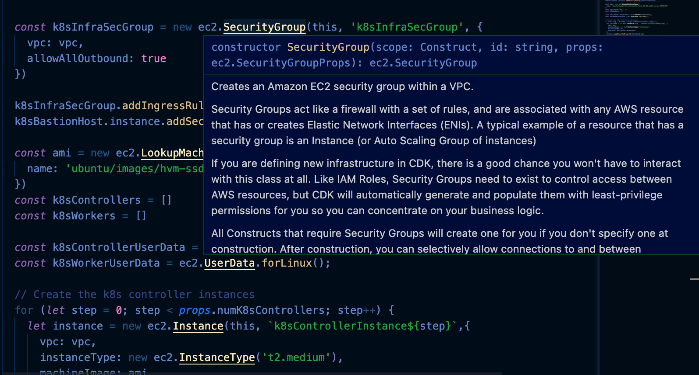

# nku-cyber-2021-iac-security

Live Demo Repo and Supporting Content for my NKU Cyber Symposium 2021 talk - The Security Engineers Guide To Infrastructure As Code!

This readme contains the code used for the demo in my talks, as well as anything I couldn't squeeze into the presentation, particularly around other tooling, reads, etc 

It should be noted that this is a "reference architecture" designed to demonstrate some key points relevant to my talk, and only meant for non-production usage in its current state. I will try to cover some of the "missing" asspects (that were mainly kept out for simplicity) below.

[Click here for the slides!](ppt/iac_security_ppt.pdf)

Demo Architecture:

## IaC Tooling

The tooling in question we are using to define our Infrastructure-As-Code is Terraform - a vendor agnostic IaC engine that can be used to manage almost anything with an API. Terraform has a concept of "Providers" - essentually plugins for the platform that tell Terraform how to communicate with an external service so you can manage it using IaC. Terraform has a massive set of official and community maintained providers - check out that list [here](https://registry.terraform.io/browse/providers)

Specifically in the Demo - we are using the AWS Terraform Provider to deploy Infrastructure into an Amazon Web Services account (More on that below).

To the point of other IaC tools - I recommend taking a look at the following:

- [Cloud Development Kit](https://aws.amazon.com/cdk/) 
- [Pulumi](https://www.pulumi.com)
- [AWS CloudFormation](https://aws.amazon.com/cloudformation/)
- [Ansible](https://github.com/ansible/ansible)
- [Kubernetes Manifests](https://kubernetes.io/docs/concepts/cluster-administration/manage-deployment/) (see also - [Helm Charts](https://artifacthub.io))

## GitOps

To recap - GitOps is the practice of using Git as a source of truth for system/infrastructure configurations.

The tooling we are using to orchestrate Terraform Plans in Pull Requests and Apply them when merged production:

- In case this wasn't obvious - GitHub is flavor of Git based source control where we are storing our IaC :smile:
- [GitHub Actions](https://docs.github.com/en/actions/learn-github-actions/understanding-github-actions) - Basically all of the .yml files you see in the [.github/workflows](.github/workflows) directory are definitions of GitHub Actions Workflows
-  [Daniel Flook's suite of Terraform GitHub Actions](https://github.com/dflook/terraform-github-actions) - basically templated automation that handles adding the Terraform Plan to our Pull Requests as comment for review, and applying it when we merge to the main branch.

Other tooling worth checking out in this space:
- [GitLab](https://about.gitlab.com) Another very popular source control system with great CI/CD capabilities
- [Atlantis](https://www.runatlantis.io) a bit more robust version of what we are running with the terraform-github-actions, popular in the community and worth a look
- [Flux](https://fluxcd.io) - specifically tooling for applying configs to K8s, which we only briefly talked about, but worth a look if you are dabbling in that space
- [AWS-CDK GitHub Actions](https://github.com/youyo/aws-cdk-github-actions) Very similiar concept to dflooks terraform-github-actions, but lets us provide a similiar workflow in Git for the AWS CDK

## Authentication/Access Control

GIven that our Demo deploys into an Amazon Web Services account - we have to provide credentials privileged enough to deploy infrastructure (or orchestrate whatever we are deploying via Terraform). In the past - this often involved creating an [IAM User](https://docs.aws.amazon.com/IAM/latest/UserGuide/id_users.html) with an associated Access Key/Secret Key combo and then providing those credentials to your GitHub Actions Workflows using [GitHub Secrets](https://docs.github.com/en/actions/security-guides/encrypted-secrets) (For those unfamiliar with AWS - these are static credentials used for programmatic access to your AWS environment). This was the only approach for providing access to CI/CD tooling external to AWS without building something custom (eg - a credential broker tool or using something like CyberArk/HashiCorp Vault). An IAM User might work for small personal projects (even then - I have a strong distaste of them), but it quickly becomes problematic at enterprise scale:
- Depending on your Account/Pipeline model, you may end up with hundreds or thousands of AWS AK/SKs
- All of these need to be periodically rotated - which also requires cooking up automation (Rotate the AK/SK and then update the value) or doing it manually

Our example is making use of the GitHub Actions OAuth capability (At the time of writing - still super new) - which basically allows us to provide temporary credentials to our CI/CD workflow by trusting GitHub (And that particular Repo, or even down to the branch level of this Repo if we so wish) to Federate to our AWS Account using OAuth. Credit to Aidan Steele and the on his super helpful guide on getting this setup [here](https://awsteele.com/blog/2021/09/15/aws-federation-comes-to-github-actions.html) and the AWS GitHub Actions Repo found [here](https://github.com/aws-actions/configure-aws-credentials)

One thing that I didn't implement for demo for the sake of keeping the demo environment simple was utilizing seperate sets of credentials (or Environments/AWS Accounts) for executing Terraform Plans on pull requests - technically in this workflow the same level of privilege is used when running Terraform in the Pull Request to get the plan. In a Production environment, you should either
- Have seperate creds to be used for pull request workflows and merges to main, to avoid exposing privileged credentials to a smart attacker without an approval
- Have a seperate staging/Dev environment where stacks are deployed to and planned against in pull requests
- A "pull" based CI/CD workflow, where the configs are automatically pulled from source control as opposed to being pushed, can mitigate the credential risk

Lastly - to my point of talking about monitoring credentials for abuse/theft, I have actually included a sample AWS Lambda Function that can take the input of a CloudTrail event, check if the role in use is our Pipeline Credential, and then if source IP Address is not a known IP Address utilized by GitHub Actions (They publish those via their metadata API, see their documentation [here](https://docs.github.com/en/actions/using-github-hosted-runners/about-github-hosted-runners) and the actual API in question [here](https://docs.github.com/en/rest/reference/meta)). Obviouly the detection logic is specific to the setup of the demo architecture, and would also be better for production by periodically copying the IP Addresses to an S3 Bucket, and then having our automation read from that and cache it (Out of scope, unless I manage to get around to it before the talk :smirk: ). [Check out the code for that](examples/github_cred_theft/handler.py). 

## State/State File

Recapping on the State File - it can (and will based on the demo) contain sensitive information, especially if your template involves secrets as data sources, or other sensitive values (you can see Terraforms own guidance on protecting the state file [here](https://www.terraform.io/docs/language/state/sensitive-data.html)).

Terraform Plans used to accidentally leak/expose sensitive values - but a feature for Terraform was added to mark values as "sensitive" preventing them from appearing in console output for plans/applys - formal announcement [here](https://www.hashicorp.com/blog/terraform-0-14-adds-the-ability-to-redact-sensitive-values-in-console-output). In addition to marking variables/properties at the template level itself sensitive - Provider developers can also do this at the provider schema level (that way the consumer of the Provider doesn't have to worry about it).

That being said - when using self hosted Terraform - absolutely be sure to take advantage of Terraforms [Remote State](https://www.terraform.io/docs/language/state/remote.html) capability - which allows you to store the state in a data store, such as an S3 bucket. If you do, be sure to:
 - apply least privileged access to the bucket
 - Protect the bucket from deletion
 - enable versioning to protect against misconfigurations
 - enable encryption at rest on the bucket (This will be transparent to TF)

## Modules/Extensions Security

As referenced in the talk - Modules/Providers/Extensions (Official terminology varies by tool) are either true code under the hood (in the case of Terraform Providers - Go, or CloudFormation Resource Providers/Custom Resources - any language that can be run in AWS Lambda), or actual code themselves (Things like Pulumi or the AWS Cloud Development Kit which define infrastructure in true, turing complete languages). With that being said - the possibility of using these as a vehicle for disguising malicious code is totally valid. Definetly not something to "gatekeep" over - but worth keeping in mind that the capability exists and could be used by an advanced threat actor/smart red teamer.

Alex Kaskaso wrote an awesome walkthrough of this abusing Terraform via malicious modules - check it out [here](https://alex.kaskaso.li/post/terraform-plan-rce)

This section spoke more to malicious code, and not a template containing a malicous configuration (eg - someone deploying Terraform that creates an external assumable role in AWS for malicious purposes)- that would be covered in part by Static Code Analysis, which is talked about below (and later in the slides).

## Codifying Best Practices - Providing Modules To Your Dev Teams

To not literally rewrite the contents of my slide here, links to all of the "Module" functionalites for each IaC tool that supports them:
 - [CloudFormation Modules](https://docs.aws.amazon.com/AWSCloudFormation/latest/UserGuide/modules.html)
 - [Terraform Modules](https://www.terraform.io/docs/language/modules/develop/index.html)
 - [AWS CDK Constructs](https://docs.aws.amazon.com/cdk/latest/guide/constructs.html)
 - [Pulumi Classes via Package Managers](https://www.pulumi.com/blog/creating-and-reusing-cloud-components-using-package-managers/)

 From the security perspective - creating and contributing to IaC modules allow us to:
  1. Get large scale security wins by baking secure design patterns into modules for common application architectures for your business. For example, a 3-tier web app with properly configured AWS Security Groups, network isolation, RDS Backups, WAF, etc, or a microservice backed by API Gateway, AWS Lambda and AWS DynamoDB with properly scoped IAM Access, Authentication, Logging, etc
  2. Take common security systems/services that teams need to use on an individual level and share them to other teams, things like WAFs, Network Firewalls, Bastion Hosts, etc are all great candidates for this.

  When writing modules - be sure to:
  - Version them!
  - Test them!
  - Use them yourself!
  - Be wary of "bad abstractions", accidentally closing over useful configuration, and realize no abstraction is often better then a bad one
  - If you are using either the AWS CDK or Pulumi, take advantage of things like **[docstrings](https://www.programiz.com/python-programming/docstrings)** that allow documentation to literally live with your module and be available from intellisense within your IDE (See the picture below for a practical example of this with the CDK, which displays the Docstring from the CDK EC2 Security Group construct). Also - embracing the static typing if available for your language of choice prevents so many pre-deployment errors!
  - Lastly, avoid the pattern of writing small wrappers around single resources or contructs. It can be tempting to write a "Secure S3" module, for example, but this often ends up in the camp of "bad abstractions" mentioned above, gets in the way of legitimate usages, and IaC SAST is a much better control for catching the things most people aim to prevent with this sort of thing. Even Terraform outright recommends against this pattern in their [When To Write A Module](https://www.terraform.io/docs/language/modules/develop/index.html#when-to-write-a-module) section of the module documentation

## Change Control And Management

On the topic of Change Control - specifically in an Infrastructure-As-Code/CICD world, the old models (eg - things like Change Approval Boards, Windows, etc), dont tend to go over well with your developers, dont scale very well, and also dont really mesh with the tenets of DevOps/CICD. However - that doesn't mean there has to be zero change control. Especially for IaC that deploys critical or sensitive systems - we can take advantage of the many features of GitHub (Other Git Providers have these things as well) to implement a development friendly change control process.
- Enabling [GitHub branch protection](https://docs.github.com/en/repositories/configuring-branches-and-merges-in-your-repository/defining-the-mergeability-of-pull-requests/about-protected-branches) rules on the main branch
- [Requiring Pull Requests before being allowed to merge](https://docs.github.com/en/repositories/configuring-branches-and-merges-in-your-repository/defining-the-mergeability-of-pull-requests/about-protected-branches#require-pull-request-reviews-before-merging)
- [Mandatory CI checks before merging](https://docs.github.com/en/repositories/configuring-branches-and-merges-in-your-repository/defining-the-mergeability-of-pull-requests/about-protected-branches#require-status-checks-before-merging) - think things like SAST, tests, building, etc

## Finding Misconfigurations Before Deployment

In our Demo Architecture - we are using [Checkov](https://github.com/bridgecrewio/checkov) via a [GitHub action](https://github.com/bridgecrewio/checkov-action) to check our Terraform templates for security issues/misconfigurations before deployment. Checkov is an Open Source Static Code Analyis tool designed specifically for Infrastructure-As-Code. It comes packed with a large amount of rules, support for several variants of IaC (Terraform, Cloudformation, K8s, Dockerfiles, Serverless Framework, and ARM templates). In addition, it also supports custom checks via Python or a specialied graph language for finding correlations between resources.

IaC SAST is great at catching common issues such as:
- World accessible security groups
- Logging not enabled
- Minor IAM Misconfigurations
- Disabled Encryption At Rest

IaC SAST tools are becoming much more common (also commercial variants), some great other open source options are:
    
- [AWS Cloudformation Guard](https://github.com/aws-cloudformation/cloudformation-guard): Originally developed only for AWS CloudFormation, Cloudformation Guard 2.0 now supports running checks (which are written in a flexible Domain Specific Language) against pretty much any JSON or YAML formatted template. In addition - if speed of scans is a concern, Cloudformation Guard is blazing fast due to being implemented in Rust!
- [Open Policy Agent](https://www.openpolicyagent.org/docs/latest/terraform/) Another popular Policy-As-Code tool, Open Policy Agent (OPA) - is owned and sponsored by the [Cloud Native Computing Foundation](https://www.cncf.io). OPA is yet another tool that utilizes a Domain Specific Language called Rego, to write rules that can then be applied to pretty much any structured JSON data. The biggest appeal for OPA is it can be used not only for IaC SAST/Policy-As-Code, but can even be used in your applications, APIs, and more to do authorization. A single paragraph wont do it justice - check out the docs [here](https://www.openpolicyagent.org/docs/latest/)
- [CDK-Nag](https://github.com/cdklabs/cdk-nag) Native tooling for running security checks on IaC tools that utilize real turing complete languages hasn't really caught on yet. A common workaround for say the CDK is the fact that behind the scenes, the AWS CDK actually builds a CloudFormation template dynamically and then deploys that, most people synthesize a template and then feed that template to a SAST tool that supports cloudformation. The issue with that pattern is that Dev Teams who get comfortable with the CDK often have to do the extra leg work to figure out how to modfiy the finding in question in their CDK Template. To that end, AWS released CDK-Nag, which from what I have found is the only security checking tool that exists for the CDK to date. While it is not technically Static Code Analysis (it requires integrated into the template as of today), it serves the same end by alerting Devs of configuration violations, and in some cases, being able to remediate them automatically!

Other Honorable mentions that I wont ramble about:
- cfn-nag
- tfscan
- terrascan
- HashiCorp Sentinel

## Credentials In Code