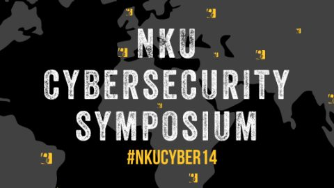

# nku-cyber-2021-iac-security

Live Demo Repo and Supporting Content for my NKU Cyber Symposium 2021 talk - The Security Engineers Guide To Infrastructure As Code!

This readme contains the code used for the demo in my talks, as well as anything I couldn't squeeze into the presentation, particularly around other tooling, reads, etc 

It should be noted that this is a "reference architecture" designed to demonstrate some key points relevant to my talk, and only meant for non-production usage in its current state. I will try to cover some of the "missing" asspects (that were mainly kept out for simplicity) below.

Slides Here

Demo Architecture:

### IaC Tooling

The tooling in question we are using to define our Infrastructure-As-Code is Terraform - a vendor agnostic IaC engine that can be used to manage almost anything with an API. Terraform has a concept of "Providers" - essentually plugins for the platform that tell Terraform how to communicate with an external service so you can manage it using IaC. Terraform has a massive set of official and community maintained providers - check out that list [here](https://registry.terraform.io/browse/providers)

Specicially in the Demo - we are using the AWS Terraform Provider to deploy Infrastructure into an Amazon Web Services account (More on that below).

To the point of other IaC tools - I recommend taking a look at the following:

Cloud Development Kit -
Pulumi -
AWS CloudFormation -
Ansible = 

### GitOps

### Authentication/Access Control

GIven that our Demo deploys into an Amazon Web Services account - we have to provide credentials privileged enough to deploy infrastructure (or orchestrate whatever we are deploying via Terraform). In the past - this often involved creating an [IAM User](https://docs.aws.amazon.com/IAM/latest/UserGuide/id_users.html) with an associated Access Key/Secret Key combo and then providing those credentials to your GitHub Actions Workflows using [GitHub Secrets](https://docs.github.com/en/actions/security-guides/encrypted-secrets) (For those unfamiliar with AWS - these are static credentials used for programmatic access to your AWS environment). This was the only approach for providing access to CI/CD tooling external to AWS without building something custom (eg - a credential broker tool or using something like CyberArk/HashiCorp Vault). An IAM User might work for small personal projects (even then - I have a strong distaste of them), but it quickly becomes problematic at enterprise scale:
- Depending on your Account/Pipeline model, you may end up with hundreds or thousands of AWS AK/SKs
- All of these need to be periodically rotated - which also requires cooking up automation (Rotate the AK/SK and then update the value) or doing it manually

### State/State File

### Modules/Extensions Security

### Codifying Best Practices - Providing Modules To Your Dev Teams

### Change Control And Management

### Finding Misconfigurations Before Deployment

### Credentials In Code